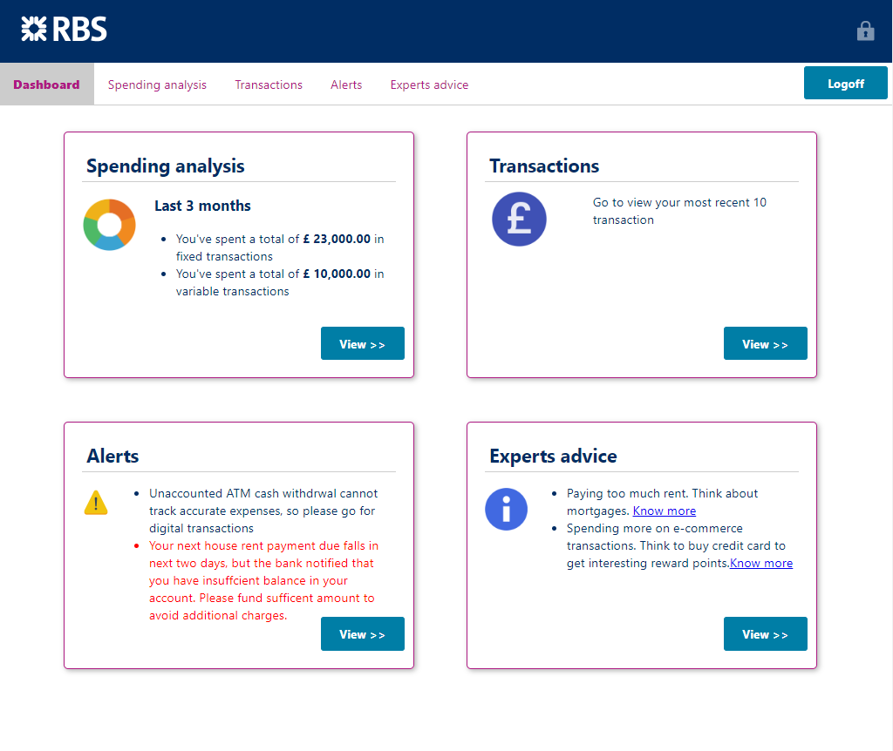

[](http://realworld.io)
[](https://travis-ci.org/gothinkster/angular-realworld-example-app)

# 

## Expenses Discovery
--------------

This application helps the customer to get a consolidated summary of his expenses and advises on new products that would suit him and any alerts, reminders for next payment and so on.

## Pre-requisites
--------------

* Download and setup the OB_UI code from the [url](https://github.com/HashApithon/openbanking-ui)
* Download and setup the sdk code from the [url](https://github.com/HashApithon/openbanking-java-sdk)
* You should have NODE JS installed on your system. You can download and install nodejs from [here](https://nodejs.org/en/download/).
* To check the version of node, use command 'node -v'
* Once nodejs is installed, install angular by using the command

``` nowrap
npm install -g @angular/cli 
```
* To check the version of angular, use command 'ng -version'
* Install Visual studio code to open the angular code [here](https://code.visualstudio.com/download)

## How to bootup the application
--------------

1.    Clone this repository.
2.    Open Visual Studio Code, Goto File > Open Folder 
3.    Select the cloned Repository  

### Install
First, install the dependencies:

``` nowrap
npm install
```
### Running the app

To build the project, use command 

``` nowrap
ng build
```

The build artifacts will be stored in the `dist/` directory.

To run the application, use command:

``` nowrap
ng serve
```

Navigate to `http://localhost:4200/`. The app will automatically reload if you change any of the source files.

To specify port as per your need

``` nowrap
ng serve --port 3000
```
The application will be up and running in specified port

## ScreenShots

### Dashboard
# 

### Expenses Insight 
# 
# 

### Alerts
# 

### Recommendations
# 

## Features
--------------

* Summary of Expenses
* Most spent areas -Expenses Trend
* View transactions
* Product Recommendations as per expense nature
* Alerts/Reminders on next important action

## Team
--------------

* Antony Gnanaraj
* RadhaKrishna Segu
* Nithya